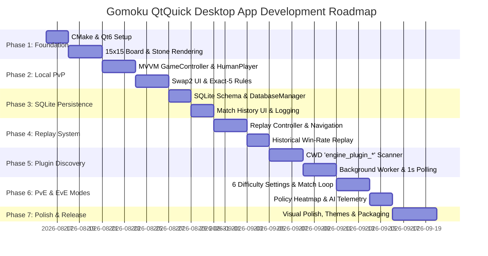

# Gomoku QtQuick Desktop Application Roadmap (`app/`)

This document defines the comprehensive architectural design, user interface specifications, persistence schema, dynamic plugin registration, and development roadmap for the **Gomoku QtQuick Application**.

The application provides a modern, high-performance desktop interface for Gomoku with complete **Swap2 opening protocol** support, dynamic engine plugin discovery (`engine_plugin_*`), SQLite-backed match recording and replay, and real-time AI win-rate telemetry.

---

## 1. High-Level Architecture

The application is structured into a clean **Model-View-ViewModel (MVVM)** architecture using **C++20** for core business logic, thread management, database persistence, and plugin loading, paired with **QtQuick (QML + JavaScript)** for the GPU-accelerated graphical interface.

```
+----------------------------------------------------------------------------------------------------+
|                                    Gomoku QtQuick QML UI Layer                                     |
|                                                                                                    |
|  +--------------------------------+   +---------------------------------------------------------+  |
|  |           MainScreen           |   |                       MatchScreen                       |  |
|  | - Seat A / B Dropdowns         |   | - 15x15 Gomoku Board (A-O, 1-15, Move # on Stones)      |  |
|  | - Difficulty Level Selector    |   | - Swap2 Interactive Control Buttons                     |  |
|  | - SQLite Match History Table   |   | - Player Info Cards & 1-Second Win Rate Polling         |  |
|  | - "Replay Match" Action        |   | - Action History Log & Match Termination Dialog         |  |
|  +--------------------------------+   +---------------------------------------------------------+  |
|                                       |                       ReplayMode                        |  |
|                                       | - Timeline Bar (|<, <, Play/Pause, >, >|) below Board   |  |
|                                       | - Move-by-move Stone Playback & Recorded Win Rate       |  |
|                                       +---------------------------------------------------------+  |
+----------------------------------------------------+-----------------------------------------------+
                                                     | Qt Property Bindings / Q_INVOKABLE Slots
                                                     v
+----------------------------------------------------------------------------------------------------+
|                                      C++ Application Backend                                       |
|                                                                                                    |
|  +------------------------+   +------------------------+   +------------------------------------+  |
|  |     GameController     |   |     BoardViewModel     |   |         ReplayController           |  |
|  | - Match lifecycle      |   | - 15x15 Grid Model     |   | - Step-by-step history navigation  |  |
|  | - Turn state & timer   |   | - Move numbers & hover |   | - Database-recorded win rate query |  |
|  | - Swap2 state machine  |   | - Exact-five win check |   | - Board state reconstruction       |  |
|  +-----------+------------+   +------------------------+   +-----------------+------------------+  |
|              |                                                               |                     |
|              | Uses                                                          | Reads/Writes        |
|              v                                                               v                     |
|  +------------------------+   +------------------------+   +------------------------------------+  |
|  |    MatchCoordinator    |   |  PluginDiscoveryModel  |   |          DatabaseManager           |  |
|  | (PvP, PvE, EvE Runner) |   | - Scans CWD for DLLs   |   | - SQLite3 embedded database        |  |
|  | - HumanPlayer bridge   |   |   matching prefix:     |   | - Matches & Move-by-move telemetry |  |
|  | - PluginPlayer adapter |   |   "engine_plugin_*"    |   | - Async write queue                |  |
|  +-----------+------------+   +-----------+------------+   +------------------------------------+  |
|              |                            |                                                        |
|              +----------------------------+                                                        |
|                                           v                                                        |
|                               +------------------------+                                           |
|                               |   EnginePluginLoader   | (plugin/ module)                          |
|                               | - Pure C-ABI dlopen    |                                           |
|                               | - IPlayer instances    |                                           |
|                               +------------------------+                                           |
+----------------------------------------------------------------------------------------------------+
```

---

## 2. Core Feature Specifications

### 2.1 Main Screen: Pre-Match Setup & Match History

Before starting a match, the user configures player seats and difficulty:

1. **Player Seat Selection (Seat A & Seat B Dropdowns)**:
   - **Seat A (Opener)**: Selects who places the opening 3 stones.
   - **Seat B (Responder)**: Selects who makes the Swap2 decision.
   - **Options in Dropdown**:
     - `"Human"` (Always available by default).
     - Dynamic entries populated by scanning the current working directory (CWD) for engine plugins matching `engine_plugin_*.so` / `engine_plugin_*.dll` / `engine_plugin_*.dylib`.
     - Displays the friendly DLL plugin name (e.g. `AlphaZero Gomoku v1.0`, `Threat-Space Solver`).

2. **Difficulty Level Dropdown**:
   - Displays the 6 standard difficulty levels defined in [`plugin/difficulty.h`](file:///home/davis/gomoku/plugin/include/plugin/difficulty.h):
     - **Apprentice (Level 0)**: High exploration, light tactical depth, beginner-friendly.
     - **Casual (Level 1)**: Basic positional heuristics, fast play.
     - **Club (Level 2)**: Intermediate tactical search, blocks obvious threats.
     - **Veteran (Level 3)**: Deep search with VCF tactical solving.
     - **Champion (Level 4)**: Master-level search, deterministic optimal moves.
     - **Truth (Level 5)**: Maximum simulation budget and analytical proof search.
   - When Human vs Human is selected, the difficulty dropdown is disabled/dimmed.

3. **Past Matches Table (SQLite Driven)**:
   - Located directly underneath the match configuration panel.
   - Columns: `Match ID`, `Date & Time`, `Seat A (Opener)`, `Seat B (Responder)`, `Winner / Result`, `Total Moves`, `Opening Plies`, `Actions`.
   - Each row contains a **"Replay"** button to inspect past games in Replay Mode.

---

### 2.2 Match Screen: Live Gameplay Interface

Upon starting a match, the view transitions to the interactive 2-pane match screen:

```
+-------------------------------------------------------+--------------------------------------------+
|                    LEFT PANE (65% width)              |            RIGHT PANE (35% width)          |
|                                                       |                                            |
|       A  B  C  D  E  F  G  H  J  K  L  M  N  O  P     | +----------------------------------------+ |
|   15  .  .  .  .  .  .  .  .  .  .  .  .  .  .  . 15  | | Seat A: Alice (Human)                  | |
|   14  .  .  .  .  .  .  .  .  .  .  .  .  .  .  . 14  | | Color: Black (⚫)   Win Rate: 52.4%     | |
|   13  .  .  .  .  .  .  .  .  .  .  .  .  .  .  . 13  | +----------------------------------------+ |
|   12  .  .  . (1) .  .  . (4) .  .  .  +  .  .  . 12  | | Seat B: Engine_AlphaZero (Veteran)     | |
|   11  .  .  .  .  .  .  .  .  .  .  .  .  .  .  . 11  | | Color: White (⚪)   Win Rate: 47.6%     | |
|   10  .  .  .  .  .  .  .  .  .  .  .  .  .  .  . 10  | +----------------------------------------+ |
|    9  .  .  .  .  .  .  .  .  .  .  .  .  .  .  .  9  |                                            |
|    8  .  .  .  .  .  .  . (3) .  .  .  .  .  .  .  8  | Phase: [ SWAP2_DECISION ]                 |
|    7  .  .  .  .  .  .  .  .  .  .  .  .  .  .  .  7  | Turn: Seat B (Waiting for action...)       |
|    6  .  .  .  .  .  .  .  .  .  .  .  .  .  .  .  6  |                                            |
|    5  .  .  .  .  .  .  .  .  .  .  .  .  .  .  .  5  | +--- Swap2 Interactive Controls ---------+ |
|    4  .  .  .  +  .  .  . (2) .  .  .  +  .  .  .  4  | | [ Choose White ]                       | |
|    3  .  .  .  .  .  .  .  .  .  .  .  .  .  .  .  3  | | [ Choose Black (Swap) ]                | |
|    2  .  .  .  .  .  .  .  .  .  .  .  .  .  .  .  2  | | [ Place Two More Stones ]              | |
|    1  .  .  .  .  .  .  .  .  .  .  .  .  .  .  .  1  | +----------------------------------------+ |
|       A  B  C  D  E  F  G  H  J  K  L  M  N  O  P     |                                            |
|                                                       | +--- Action History ---------------------+ |
|                                                       | | 1. Black at H8 (Move 1)                | |
|                                                       | | 2. White at H4 (Move 2)                | |
|                                                       | | 3. Black at D12 (Move 3)               | |
|                                                       | | ...                                    | |
|                                                       | +----------------------------------------+ |
|                                                       | [ Resign ]   [ Return to Home ]            |
+-------------------------------------------------------+--------------------------------------------+
```

#### Left Pane: 15x15 Gomoku Board
- **Grid Layout**: Standard $15 \times 15$ intersections with realistic wood texture / clean dark canvas styling.
- **Coordinate Labeling**:
  - Horizontal X-axis: Alphabets `A` through `O` (15 columns).
  - Vertical Y-axis: Numbers `1` through `15` (1 at bottom, 15 at top).
- **Star Points (Hoshiboshi)**: 5 subtle star point dots marked at $(D,4), (D,12), (H,8), (L,4), (L,12)$ — corresponding to coordinates $(3,3), (3,11), (7,7), (11,3), (11,11)$.
- **Stones with Move Numbers**:
  - Rendered as crisp circles with realistic 3D radial shading.
  - **Black Stones**: Deep charcoal/black with white move number centered.
  - **White Stones**: Pearl/off-white with black move number centered.
  - **Latest Move Highlight**: Glowing accent ring / marker around the most recent placement.
- **Human Input Handling**:
  - Mouse hover displays a translucent "ghost stone" on the targeted empty intersection.
  - Clicks submit the move if it is the human player's turn and the action is legal.
  - During opponent/engine turns, the board disables click interaction and displays a thinking indicator.

#### Right Pane: Telemetry & Controls
1. **Player Info Cards**:
   - Player name, seat assignment (`Seat A` or `Seat B`), assigned stone color (`⚫ Black`, `⚪ White`, or `Pending`).
   - **Live Estimated Win Rate**: Refreshed **every 1 second** by polling the active engine's `GetEstimatedWinRate()` API.
   - Visual win-rate gauge bar ($0\%$ to $100\%$).
2. **Current Game Phase Display**:
   - Clear badge showing the current phase:
     - `PLACE_INITIAL_THREE`: Seat A placing 3 stones (B-W-B).
     - `SWAP2_DECISION`: Seat B choosing color or 2 additional stones.
     - `SWAP2_PLACE_TWO`: Seat B placing 2 stones (W-B).
     - `CHOOSE_COLOR`: Seat A choosing final color.
     - `STANDARD`: Alternating regular play.
     - `FINISHED`: Game completed.
3. **Swap2 Interactive Control Buttons**:
   - Context-sensitive button group displayed only when a human player is on turn during a Swap2 decision phase:
     - **During `SWAP2_DECISION`**:
       - `[ Choose White ]` (Action ID `225`): Seat B takes White, Seat A keeps Black.
       - `[ Choose Black (Swap) ]` (Action ID `226`): Seat B takes Black, Seat A becomes White.
       - `[ Place Two More Stones ]` (Action ID `227`): Transitions to `SWAP2_PLACE_TWO`.
     - **During `CHOOSE_COLOR`**:
       - `[ Choose White ]` (Action ID `228`): Seat A takes White, Seat B takes Black.
       - `[ Choose Black ]` (Action ID `229`): Seat A takes Black, Seat B takes White.
4. **Action History Log**:
   - Scrollable list detailing every ply:
     - Ply number, stone color, coordinate (e.g. `H8`) or Swap2 action label (e.g. `swap2_choose_white`), player seat, win rate snapshot, timestamp.
5. **Match Controls**:
   - `[ Resign ]`: Forfeits the match for the active human player.
   - `[ Return to Home ]`: Prompts to leave match or aborts in-progress game.

---

### 2.3 Game Rule & Referee Enforcement

The application incorporates a strict, project-neutral rules referee adhering to [`protocol/spec.md`](file:///home/davis/gomoku/protocol/spec.md):

1. **Exact-Five Win Rule**:
   - A player wins if and only if they form a continuous line of **exactly five** stones of their color horizontally, vertically, or diagonally.
   - **Overlines (6 or more stones in a row)** do **NOT** count as a win; play continues.
2. **Illegal Action Immediate Forfeiture**:
   - If an engine plugin or human player submits an illegal move (e.g. placing on an occupied intersection, selecting Swap2 buttons in standard phase, or moving out of turn), the referee **immediately terminates the match and awards victory to the opponent** with reason `illegal_action`.
3. **Swap2 State Machine Validation**:
   - Stones $1, 2, 3$ are placed by Seat A (Colors: Black, White, Black).
   - Seat B submits Swap2 decision (`choose_white`, `choose_black`, `place_two`).
   - If `place_two` is chosen, Seat B places stones $4, 5$ (Colors: White, Black), and Seat A chooses color (`choose_white`, `choose_black`).
   - In `STANDARD` phase, White always plays first after color assignment (move 4 or move 6).
4. **Draw Conditions**:
   - Board full ($225$ stones) with no exact-five win.
   - Exact-five formed during opening Swap2 phases before seat-to-color assignment results in a draw.

---

### 2.4 Replay Mode: Past Match Step-by-Step Viewer

When opening any past match from the SQLite database:

```
+----------------------------------------------------------------------------------------------------+
|                                    Match Replay: Match #0042                                       |
|                              Alice (Black) vs AlphaZero_Veteran (White)                            |
|                                     Result: Black Win (Move 37)                                    |
+----------------------------------------------------------------------------------------------------+
|                                                                                                    |
|                                       15x15 Gomoku Board                                           |
|                            (Displays stones up to current ply step)                                |
|                                                                                                    |
+----------------------------------------------------------------------------------------------------+
|  [ |< First ]   [ < Prev ]   [  Play / Pause  ]   [ Next > ]   [ Last >| ]   Ply: 18 / 37          |
|  [=====================================●-------------------------------------------------] Slider  |
+----------------------------------------------------------------------------------------------------+
|  Move: #18 (White at G9) | Win Rate Snapshot: 48.2% White | Eval Delta: -3.1%                       |
+----------------------------------------------------------------------------------------------------+
```

- **Navigation Controls (Directly Below Board)**:
  - `|<` (Jump to Start / Move 0).
  - `<` (Step Backward one ply).
  - `Play / Pause` (Auto-advance with configurable speed: 0.5s, 1s, 2s).
  - `>` (Step Forward one ply).
  - `>|` (Jump to Final Position).
  - Interactive scrubbing slider to drag directly to any ply.
- **Move Number Display**:
  - Board reconstructs state at chosen ply. All stones up to that ply are rendered with their move numbers.
- **Recorded Win Rate Telemetry**:
  - Displays the recorded win-rate value for each ply.
  - The win-rate value is read directly from the SQLite database, which stored the engine's evaluation snapshot immediately after the engine action inquiry during live play.

---

### 2.5 Dynamic Engine Plugin Discovery (`engine_plugin_*`)

To allow plug-and-play addition of new Gomoku engines without recompiling the application:

1. **Discovery Mechanism**:
   - On startup (and upon manual "Refresh Plugins" request), the application scans the Current Working Directory (CWD) and optional `./plugins/` subdirectory.
   - Identifies all shared library files starting with the prefix `engine_plugin_`:
     - Linux: `engine_plugin_*.so`
     - Windows: `engine_plugin_*.dll`
     - macOS: `engine_plugin_*.dylib`
2. **Plugin Registration & Metadata Loading**:
   - Uses `gomoku::plugin::EnginePluginLoader::LoadPlugin(path)`.
   - Calls `gomoku_plugin_get_info()` to extract:
     - `plugin_name` (e.g. `"AlphaZero Engine"`).
     - `plugin_version` (e.g. `"1.2.0"`).
     - `author` (e.g. `"DeepMind Gomoku Team"`).
   - Populates the Seat A and Seat B dropdown menus with the discovered plugin names.
3. **Execution Isolation**:
   - Instantiates an `IPlayer` adapter via `LoadedPlugin::CreatePlayer()`.
   - Runs engine thinking in a background worker thread (`std::jthread` / `QThread`) to guarantee the GUI remains buttery-smooth at 60+ FPS.

---

## 3. Persistence: SQLite Database Schema

The application embeds an SQLite3 database (`gomoku_app.sqlite` in standard app data path) to persist every match and move-by-move telemetry.

### 3.1 Database Tables

```sql
-- Table: matches (Stores match metadata and final outcome)
CREATE TABLE IF NOT EXISTS matches (
    match_id INTEGER PRIMARY KEY AUTOINCREMENT,
    created_at TIMESTAMP DEFAULT CURRENT_TIMESTAMP,
    player_a_name TEXT NOT NULL,
    player_a_type TEXT NOT NULL,         -- 'human' or plugin DLL name
    player_b_name TEXT NOT NULL,
    player_b_type TEXT NOT NULL,         -- 'human' or plugin DLL name
    difficulty_a INTEGER DEFAULT 3,      -- 0=Apprentice ... 5=Truth
    difficulty_b INTEGER DEFAULT 3,
    board_size INTEGER DEFAULT 15,
    result TEXT NOT NULL,                -- 'PLAYER_A_WIN', 'PLAYER_B_WIN', 'DRAW', 'UNDETERMINED'
    winner_seat TEXT,                    -- 'A', 'B', or NULL
    termination_reason TEXT NOT NULL,    -- 'five_in_a_row', 'illegal_action', 'resignation', 'draw'
    total_plies INTEGER NOT NULL,
    opening_path INTEGER NOT NULL        -- 1=Swap2 White, 2=Swap2 Black, 3=Swap2 Place Two
);

-- Table: match_moves (Stores every move with board coordinates and AI win rate snapshot)
CREATE TABLE IF NOT EXISTS match_moves (
    move_id INTEGER PRIMARY KEY AUTOINCREMENT,
    match_id INTEGER NOT NULL,
    ply_index INTEGER NOT NULL,          -- 1, 2, 3, ...
    action_id INTEGER NOT NULL,          -- 0..224 (placement) or 225..229 (Swap2 control)
    action_label TEXT NOT NULL,          -- e.g. '(7,7)', 'swap2_choose_white'
    x_coord INTEGER,                     -- 0..14 (NULL for control actions)
    y_coord INTEGER,                     -- 0..14 (NULL for control actions)
    seat TEXT NOT NULL,                  -- 'A' or 'B'
    stone_placed TEXT NOT NULL,          -- 'BLACK', 'WHITE', 'NONE'
    phase_at_move TEXT NOT NULL,         -- 'PLACE_INITIAL_THREE', 'SWAP2_DECISION', etc.
    estimated_win_rate REAL,             -- Win rate snapshot [-1.0..1.0] or [0.0..1.0] from engine inquiry
    time_spent_ms INTEGER,               -- Time elapsed before move was submitted
    timestamp TIMESTAMP DEFAULT CURRENT_TIMESTAMP,
    FOREIGN KEY (match_id) REFERENCES matches(match_id) ON DELETE CASCADE
);

CREATE INDEX IF NOT EXISTS idx_moves_match_id ON match_moves(match_id);
```

---

## 4. Class Design & Component Hierarchy

### 4.1 C++ Core Components

```
app/src/
├── core/
│   ├── app_constants.h             # UI constants, color palettes, board dimensions
│   ├── database_manager.h/.cpp     # SQLite3 manager with prepared queries & async writer
│   ├── game_controller.h/.cpp      # Match state coordinator, timer, and rule engine
│   ├── board_view_model.h/.cpp     # 15x15 QAbstractListModel for QML GridView / Canvas
│   ├── replay_controller.h/.cpp    # History playback state and step navigation
│   └── plugin_registry.h/.cpp      # CWD scanner for 'engine_plugin_*' DLLs
├── models/
│   ├── match_history_model.h/.cpp  # QAbstractTableModel for past matches UI
│   └── move_history_model.h/.cpp   # QAbstractListModel for move log UI
└── main.cpp                        # Qt Application initialization & QML registration
```

#### Key Classes & Roles

1. **`GameController` (Exported to QML as `GameController`)**:
   - Properties: `gamePhase`, `currentTurnSeat`, `isHumanTurn`, `winnerSeat`, `isGameOver`, `playerAWinRate`, `playerBWinRate`, `openingActionPrompt`.
   - Signals: `matchStarted()`, `turnChanged()`, `moveApplied(int actionId)`, `matchFinished(QString result, QString reason)`, `winRateUpdated(double winRate)`.
   - Methods (`Q_INVOKABLE`):
     - `startMatch(QString seatAPlayer, QString seatBPlayer, int difficultyA, int difficultyB)`
     - `submitBoardClick(int x, int y)`
     - `submitSwap2Action(int actionId)`
     - `resignMatch()`
     - `abortMatch()`

2. **`BoardViewModel` (Exported to QML as `BoardModel`)**:
   - Exposes $15 \times 15 = 225$ cell elements with roles: `cellX`, `cellY`, `stoneColor` (Empty/Black/White), `moveNumber` (0 if empty), `isLatestMove`, `isWinningFive`.
   - Manages instant O(1) cell updates and fast batch reset.

3. **`PluginRegistry` (Exported to QML as `PluginRegistry`)**:
   - Exposes `QStringList availableEngines` (always starts with `"Human"`, followed by discovered `engine_plugin_*` names).
   - Method: `rescanPlugins()` to reload DLLs dynamically without restarting the app.

4. **`DatabaseManager`**:
   - Thread-safe SQLite read/write operations.
   - `RecordMatchStart(...)`, `RecordMove(...)`, `RecordMatchEnd(...)`.
   - `FetchMatchHistory()`, `FetchMatchMoves(int matchId)`.

---

### 4.2 QML UI Hierarchy

```
app/qml/
├── Main.qml                        # ApplicationWindow with StackView routing
├── screens/
│   ├── MainScreen.qml              # Match Setup & Match History Table
│   ├── MatchScreen.qml             # Live Gameplay (Board + Controls + Telemetry)
│   └── ReplayScreen.qml            # Match Replay with Timeline Navigation
├── components/
│   ├── GomokuBoard.qml             # Interactive 15x15 Canvas / Grid with A-O, 1-15 axis
│   ├── BoardCell.qml               # Single intersection with hover ghost stone
│   ├── Stone.qml                   # 3D shaded Black/White stone with move number text
│   ├── PlayerCard.qml              # Player seat, name, color, and live win-rate bar
│   ├── Swap2Controls.qml           # Context-sensitive Swap2 action buttons
│   ├── WinRateGauge.qml            # Visual probability gauge (refreshed every 1s)
│   ├── ActionHistoryView.qml       # Scrollable list of plies
│   ├── ReplayControls.qml          # Timeline controls (|<, <, Play, >, >|, slider)
│   └── MatchHistoryTable.qml       # Sortable SQLite history table with Replay button
└── theme/
    └── GomokuTheme.qml             # HSL color tokens, board wood textures, fonts
```

---

## 5. Implementation Roadmap (Phased Approach)



---

### Phase 1: Project Skeleton & Interactive Board Component
- **Objective**: Establish the standalone CMake build system for `app/`, integrate Qt 6 Quick/QML, link against `plugin_lib`, and build a high-performance $15 \times 15$ board component.
- **Key Deliverables**:
  - `CMakeLists.txt` configured for Qt 6 (Core, Quick, Gui, Widgets, Sql) and C++20.
  - `GomokuBoard.qml` with vector grid lines, coordinate headers ($A \dots O$ horizontal, $1 \dots 15$ vertical), and star points $(D4, D12, H8, L4, L12)$.
  - `Stone.qml` with radial gradients for Black and White stones, dynamic centered move number text, and latest-move ring indicator.
  - Responsive layout adjusting cleanly to window resize.

---

### Phase 2: Local Human vs Human (PvP) & Swap2 Interaction
- **Objective**: Implement local two-player game loop on the same machine, incorporating the complete Swap2 opening state machine, exact-five win checks, and illegal move detection.
- **Key Deliverables**:
  - `GameController` and `BoardViewModel` bridging QML actions to the Gomoku rules engine.
  - Contextual `Swap2Controls.qml` supporting:
    - Phase 0: Opener placing 3 stones ($B-W-B$).
    - Phase 1: Responder selecting `Choose White`, `Choose Black (Swap)`, or `Place 2 More Stones`.
    - Phase 2: Responder placing 2 stones ($W-B$).
    - Phase 3: Opener selecting `Choose White` or `Choose Black`.
    - Phase 4: Standard alternating play.
  - Automatic referee rule checks: exact-five detection, overline handling (no win), and immediate forfeiture on illegal action.
  - Match completion modal with result announcement and reason.

---

### Phase 3: SQLite Persistence & Match History View
- **Objective**: Integrate embedded SQLite3 persistence to automatically log every match and move-by-move telemetry, and display past matches on the main screen.
- **Key Deliverables**:
  - `DatabaseManager` initializing SQLite schema (`matches` and `match_moves` tables).
  - Background database recording of match start, moves with timestamps, and match results.
  - `MatchHistoryTable.qml` embedded on `MainScreen.qml` displaying past matches with search/filter capabilities.
  - Quick launch "Replay" action from any past match record.

---

### Phase 4: Match Replay System & Historical Win-Rate Display
- **Objective**: Implement full match replay functionality with timeline navigation placed directly below the board.
- **Key Deliverables**:
  - `ReplayController.h/.cpp` loading match records from SQLite and reconstructing board state at arbitrary plies.
  - `ReplayControls.qml` bar positioned directly under `GomokuBoard.qml` with `|<`, `<`, `Play/Pause`, `>`, `>|`, and an interactive scrubbing slider.
  - Move-by-move stone rendering displaying move numbers up to current replay step.
  - Reading and displaying the engine's recorded estimated win rate snapshot saved at move inquiry time.

---

### Phase 5: Dynamic Engine Plugin Discovery (`engine_plugin_*`)
- **Objective**: Implement dynamic scanning of the current working directory for engine DLLs starting with `engine_plugin_`, enabling plug-and-play AI player integration.
- **Key Deliverables**:
  - `PluginRegistry` scanning CWD for `engine_plugin_*.{so,dll,dylib}` using `std::filesystem`.
  - Integration with `gomoku::plugin::EnginePluginLoader` to load plugins and populate Seat A and Seat B dropdown lists with DLL plugin names.
  - Background worker thread (`QThread` / `std::jthread`) to run engine search asynchronously without blocking the Qt Quick UI thread.
  - 1-second interval timer (`QTimer`) querying `IPlayer::GetEstimatedWinRate()` to update the live win-rate telemetry bar in real time.

---

### Phase 6: PvE & EvE Modes with 6 Difficulty Settings
- **Objective**: Enable full Player vs Engine (PvE) and Engine vs Engine (EvE) matches with difficulty level configuration.
- **Key Deliverables**:
  - Match setup passing selected `Difficulty` (Apprentice, Casual, Club, Veteran, Champion, Truth) to `IPlayer::OnMatchStart`.
  - Support for fully automated AI vs AI matches with animated step delays.
  - Real-time policy distribution preview (optional heatmap or top-3 candidate move highlights on the board).
  - Proper cancellation of in-flight searches on match resignation or window close via `IPlayer::CancelInquiry()`.

---

### Phase 7: Visual Polish, Themes, Audio & Packaging
- **Objective**: Refine visual aesthetics, add board themes (Japanese Kaya wood, modern slate dark mode), smooth animations, and cross-platform packaging.
- **Key Deliverables**:
  - Beautiful visual themes: Classical Kaya Wood, Charcoal Minimalist, High-Contrast Tournament.
  - Smooth stone drop physics / micro-animations on placement.
  - Sound effects for stone clicks and victory/defeat chimes.
  - Unit tests for `GameController`, `BoardViewModel`, `DatabaseManager`, and `ReplayController`.
  - Packaging scripts for standalone desktop distribution.

---

## 6. Directory Structure

```
gomoku/
├── app/
│   ├── CMakeLists.txt                # Build configuration for QtQuick app
│   ├── GEMINI.md                     # This architectural specification & roadmap
│   ├── qml/
│   │   ├── components/               # Reusable QML components
│   │   │   ├── ActionHistoryView.qml
│   │   │   ├── BoardCell.qml
│   │   │   ├── GomokuBoard.qml
│   │   │   ├── MatchHistoryTable.qml
│   │   │   ├── PlayerCard.qml
│   │   │   ├── ReplayControls.qml
│   │   │   ├── Stone.qml
│   │   │   ├── Swap2Controls.qml
│   │   │   └── WinRateGauge.qml
│   │   ├── screens/                  # Top-level screen views
│   │   │   ├── MainScreen.qml
│   │   │   ├── MatchScreen.qml
│   │   │   └── ReplayScreen.qml
│   │   ├── theme/
│   │   │   └── GomokuTheme.qml
│   │   ├── Main.qml
│   │   └── qml.qrc                   # Qt Resource package
│   ├── src/
│   │   ├── core/
│   │   │   ├── app_constants.h
│   │   │   ├── board_view_model.cpp
│   │   │   ├── board_view_model.h
│   │   │   ├── database_manager.cpp
│   │   │   ├── database_manager.h
│   │   │   ├── game_controller.cpp
│   │   │   ├── game_controller.h
│   │   │   ├── plugin_registry.cpp
│   │   │   ├── plugin_registry.h
│   │   │   ├── replay_controller.cpp
│   │   │   └── replay_controller.h
│   │   ├── models/
│   │   │   ├── match_history_model.cpp
│   │   │   ├── match_history_model.h
│   │   │   ├── move_history_model.cpp
│   │   │   └── move_history_model.h
│   │   └── main.cpp
│   └── tests/
│       ├── board_view_model_test.cpp
│       ├── database_manager_test.cpp
│       └── game_controller_test.cpp
├── plugin/                           # Standalone Engine Plugin SDK & Loader
│   ├── include/plugin/
│   │   ├── difficulty.h
│   │   ├── gomoku_types.h
│   │   ├── human_player.h
│   │   ├── match_coordinator.h
│   │   ├── player_interface.h
│   │   ├── plugin_api.h
│   │   └── plugin_loader.h
│   └── ...
└── protocol/
    └── spec.md                       # Canonical Swap2 referee specification
```

---

## 7. Building & Running the Qt Application

### 7.1 Prerequisites
- **C++ Compiler**: GCC 11+, Clang 13+, or MSVC 2022 (C++20 required)
- **CMake**: 3.16+
- **Qt 6**: `Qt6::Core`, `Qt6::Quick`, `Qt6::Gui`, `Qt6::Sql`, `Qt6::Widgets`
- **SQLite3**: System SQLite3 library (or Qt SQLite plugin)

### 7.2 Build Instructions
```bash
# From workspace root
mkdir -p build_app && cd build_app
cmake ../app -DCMAKE_BUILD_TYPE=Release
make -j$(nproc)

# Launch the Gomoku QtQuick application
./gomoku_app
```

---

## 8. Verification & Testing Strategy

1. **Unit Testing**:
   - `game_controller_test`: Verifies Swap2 transitions, illegal move detection, and exact-five terminal win checks.
   - `database_manager_test`: Verifies SQLite table creation, record insertion, move telemetry query, and replay reconstruction.
   - `plugin_registry_test`: Verifies automatic detection of dummy `engine_plugin_*.so` dynamic libraries in CWD.
2. **Integration & Manual UI Testing**:
   - **Human vs Human (PvP)**: Play complete games locally; verify stone move numbering, Swap2 button state flow, and winning line highlights.
   - **Replay Verification**: Open recorded matches from the history table; step forward/backward using the navigation bar and slider; confirm stones and win rates match live match history.
   - **Plugin Integration (PvE & EvE)**: Drop sample plugin (`engine_plugin_sample.so`) into CWD; verify it appears in the Seat dropdowns and plays properly across different difficulty levels while live win rate updates every second.
